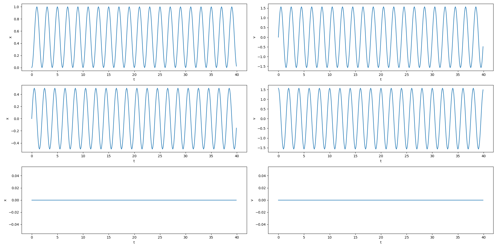
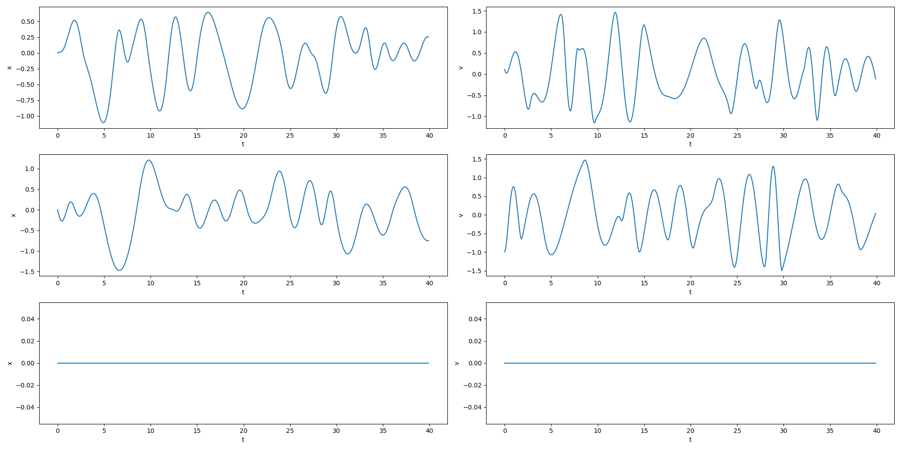

# Neural Internal Model Control

<!-- ## <font><div align='center' > [[📜 arXiv Paper](https://arxiv.org/abs/2411.13079)]  [[📹 Supplementary Video](https://www.youtube.com/watch?v=7MChzWLqbZk&ab_channel=FengGao)] </div> </font> -->
[](https://arxiv.org/abs/2411.13079)
[](https://www.youtube.com/watch?v=7MChzWLqbZk)
[](https://github.com/UltronAI/NeuralIMC-Quadruped)


## Installation


```bash
conda create -n torchctrl python=3.9
conda activate torchctrl
pip install -e .
```

## Trajectory examples used for experiments

| Trajectory Type | Description | 3D Trajectory | Per-axis Trajectory | Implementation |
|----------------|-------------|------------|------------|------------|
| Circle         | Circular trajectory |  |  | [circle.py](torch_control/tasks/trajectory/circle.py)
| Poly     | Chained polynomial trajectories |  |  | [chained_polynomial.py](torch_control/tasks/trajectory/chained_polynomial.py)
| Star          | 5-pointed star trajectory |  |  | [pointed_star.py](torch_control/tasks/trajectory/pointed_star.py)
| Zigzag          | Zigzag trajectory |  |  | [zigzag.py](torch_control/tasks/trajectory/zigzag.py)


## Usage

### Tuning the controller parameters

```bash
conda activate torchctrl && cd scripts
# By default, it will use wandb to log data, please make sure you have set WANDB_API_KEY in your environment variables.
python run_quadrotor.py
# To run without wandb logging, use the following command:
python run_quadrotor.py wandb.mode=disabled
```

Refer to `scripts/train/shell_scripts` for more experiment scripts.

## Quadruped experiments

Check [this repo](https://github.com/UltronAI/NeuralIMC-Quadruped) for more details.

## Citation

If you find our codebase or our proposed trick (predictive error feedback) useful, please cite our paper:

```bibtex
@ARTICLE{11012678,
  author={Gao, Feng and Yu, Chao and Wang, Yu and Wu, Yi},
  journal={IEEE Robotics and Automation Letters}, 
  title={Neural Internal Model Control: Learning a Robust Control Policy Via Predictive Error Feedback}, 
  year={2025},
  volume={10},
  number={7},
  pages={6848-6855},
  keywords={Predictive models;Robots;Quadrotors;Adaptation models;Legged locomotion;Mathematical models;Training;Robustness;Robust control;Adaptive control;Robust control;reinforcement learning (RL);sensorimotor learning},
  doi={10.1109/LRA.2025.3573169}}
```