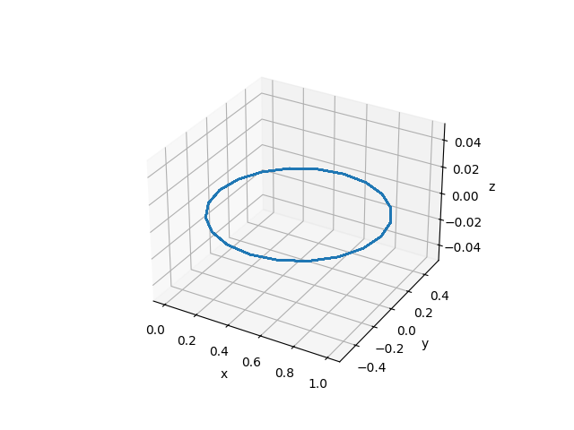
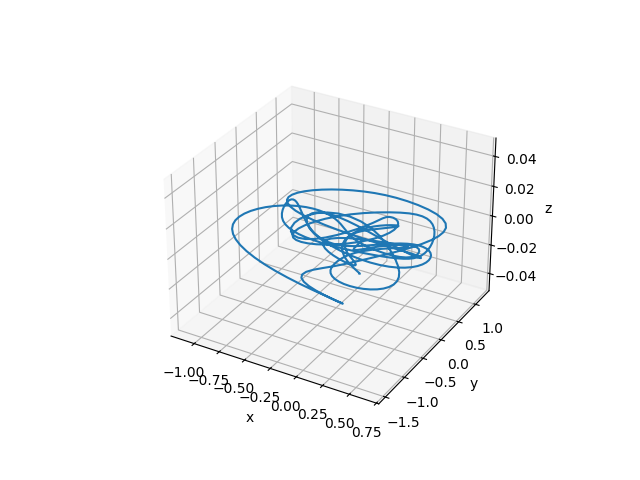
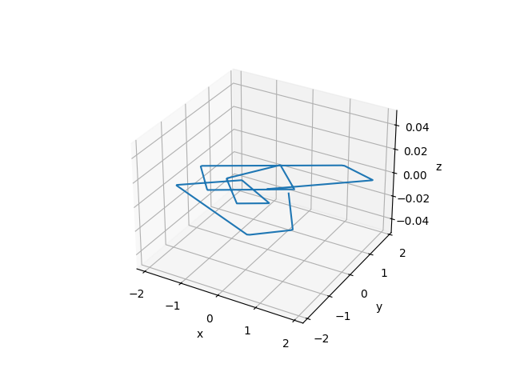

# Neural Internal Model Control

## <font><div align='center' > [[📜 arXiv Paper](https://github.com/thu-uav/NeuralIMC)]  [[📹 Supplementary Video](https://www.youtube.com/watch?v=7MChzWLqbZk&ab_channel=FengGao)] </div> </font>


---
## TODO

- [ ] Clean codes and update README
- [ ] Codes for experiments on quadrupeds

## Installation


```bash
conda create -n torchctrl python=3.9
cd torch_control
conda activate torchctrl
pip install -e .
```

## Trajectory examples used for experiments

| Trajectory Type | Description | 3D Trajectory | Per-axis Trajectory | Implementation |
|----------------|-------------|------------|------------|------------|
| Circle         | Circular trajectory |  |  | [circle.py](torch_control/tasks/trajectory/circle.py)
| Poly     | Chained polynomial trajectories |  |  | [chained_polynomial.py](torch_control/tasks/trajectory/chained_polynomial.py)
| Star          | 5-pointed star trajectory |  |  | [pointed_star.py](torch_control/tasks/trajectory/pointed_star.py)
| Zigzag          | Zigzag trajectory |  |  | [zigzag.py](torch_control/tasks/trajectory/zigzag.py)


## Usage

### Tuning the controller parameters

```bash
conda activate torchctrl && cd scripts
# By default, it will use wandb to log data, please make sure you have set WANDB_API_KEY in your environment variables.
python run_quadrotor.py
# To run without wandb logging, use the following command:
python run_quadrotor.py wandb.mode=disabled
```
